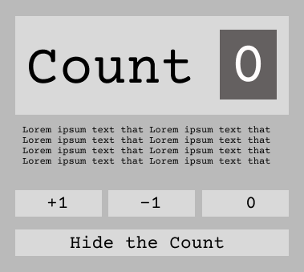

# REACTJS HOOKS REVIEW with a webapp

### by [Bishal Giri]("https://www.bishalgiri.com")

 

### Initial Look:

### Some designs on figma that I'm working on right now :

 

## Some notes for flexbox

**justify-content:**
- flex-start: Items align to the **left** side of the container.
- flex-end: Items align to the **right** side of the container.
- center: Items align at the **center** of the container.
- space-between: Items display with equal spacing **between** them.
- space-around: Items display with equal spacing **around** them.
- space-evenly: 

**align-items**
- flex-start: Items align to the **top** of the container.
- flex-end: Items align to the **bottom** of the container.
- center: Items align at the **vertical** center of the container.
- baseline: Items display at the **baseline** of the container.
- stretch: Items are **stretched** to fit the container.

**flex-direction**
- row: Items are placed the same as the text direction.
- row-reverse: Items are placed opposite to the text direction.
- column: Items are placed top to bottom.
- column-reverse: Items are placed bottom to top.

> "order" can be given an interger value to make it as a ordered element

**flex-wrap**
- nowrap: Every item is fit to a single line.
- wrap: Items wrap around to additional lines.
- wrap-reverse: Items wrap around to additional lines in reverse.

> "flex-flow" can be used to combine flex-wrap and flex-direction ex. flex-flow: wrap column;

**align-content**
- flex-start: Lines are packed at the **top** of the container.
- flex-end: Lines are packed at the **bottom** of the container.
- center: Lines are packed at the **vertical** center of the container.
- space-between: Lines display with equal spacing **between** them.
- space-around: Lines display with equal spacing **around** them.
- stretch: Lines are **stretched** to fit the container.

> **align-content** determines the spacing between lines, while **align-items** determines how the items as a whole are aligned within the container. When there is only one line, **align-content** has no effect.
> 

> Just know that wr applies to items on multiple lines

> https://www.lireo.com/fun-online-games-to-learn-flexbox-and-css/